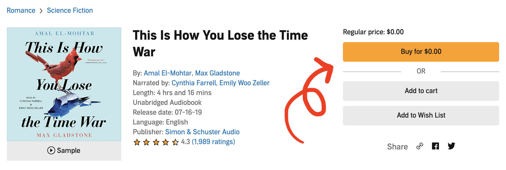

### Background

This is the <a href="https://www.audible.com/">Audible</a> buybox. On all platforms and devices, it presents purchase options available to the user.

### My Work

I upgraded the special promotion section of the Audible buy box in Java to minimize code redundancy, centralize logic, mitigate error boundaries, and improve consistency across buy boxes. I designed a BOGO API while following existing architectural standards to integrate section into website framework.

### Reflection

A huge thank you to Xinyu Zhang, Mayank Gupta, Doug Haber, and the Rubiks team for for their support and guidance throughout the summer!

