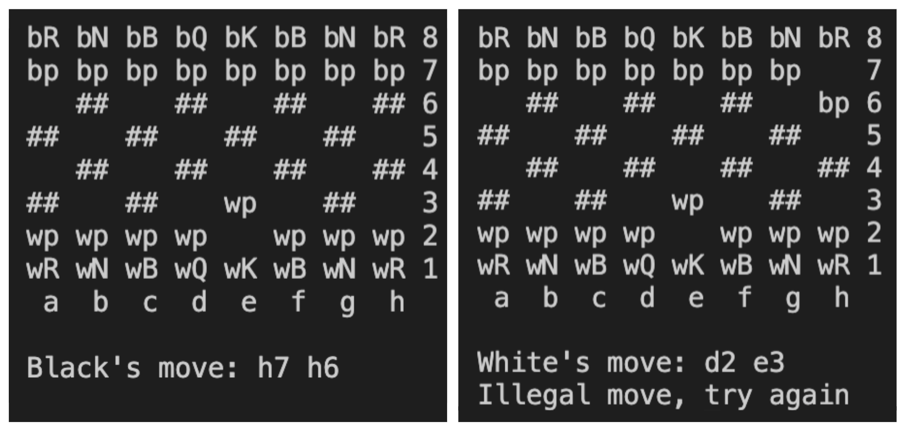
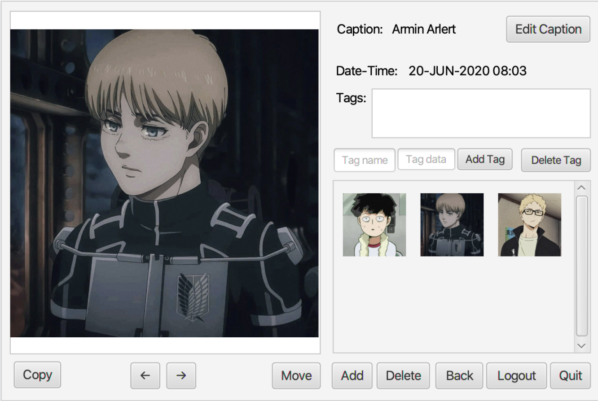
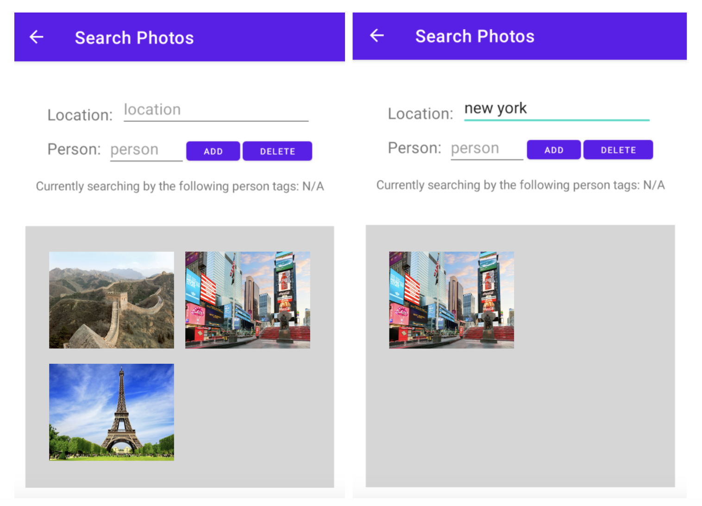
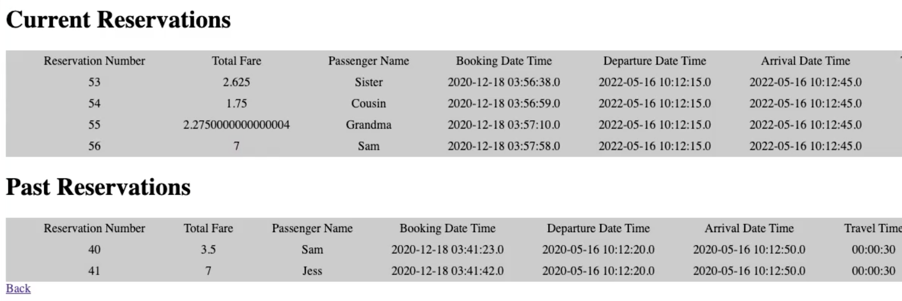
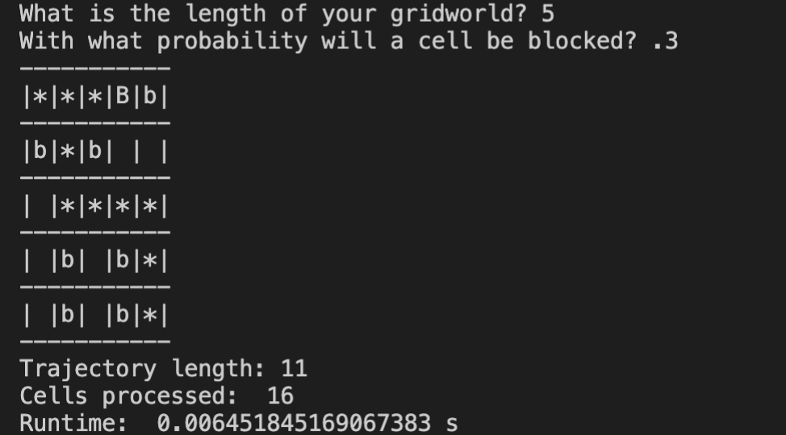
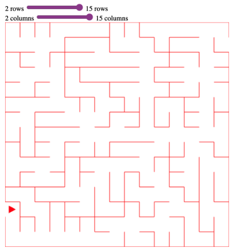
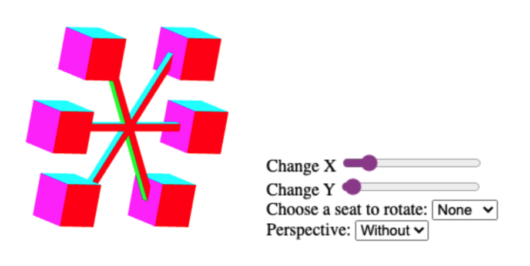

---
title: "Course Projects"
tags: ["rutgers"]
linkTitles: []
actualLinks: []
description: "Projects completed for coursework."
season: "All Semesters"
start: 
end: "2019"
--- 

### Software Methodology [<a href="https://www.cs.rutgers.edu/academics/undergraduate/course-synopses/course-details/01-198-213-software-methodology">CS213</a>]

  
Chess

  This command-line program, built in Java, establishes a manual 2-player game of chess. It detects illegal moves, supports special moves like en passant, castling, and pawn promotion, and ends once a checkmate occurs.
  
  

  
JavaFX Photo Library

  This photo library, built using Java, JavaFX, and XML, is an application that supports user authentication, image upload, and image organization via albums, search functions, tags, and date-times. 

  

  
Android Photo Library

  This photo library, built using Java in Android Studio, is a phone app that supports user authentication, image upload, and image organization via albums, search functions, tags, and date-times. 

  

#
### Systems Programming [<a href="https://www.cs.rutgers.edu/academics/undergraduate/course-synopses/course-details/01-198-214-systems-programming">CS214</a>] 

  
Where's the File?

  Where's the File? (WTF) is a fully functional client-server version control system written in C. Through sockets, file I/O, and multithreading, it allows up to ten clients to interact with, push projects to, get projects from, and otherwise modify a repository in a remote server. While a local version of the repository exists on the client-side, the server maintains the version most recently pushed while keeping track of the project's history. WTF supports the following commands: configure, checkout, update, upgrade, commit, push, create, destroy, add, remove, currentVersion, history, and rollback. <a href="https://github.com/matthew-notaro/Systems-Programming/tree/master/AsstLast">View source here.</a>

#
### Info & Data Management [<a href="https://www.cs.rutgers.edu/academics/undergraduate/course-synopses/course-details/01-198-336-principles-of-information-and-data-management">CS336</a>]

  
Train Scheduler

    Train Scheduler is a full-stack train booking web app that stores train routes and user data via efficient database schema. Users can search train routes stored in an AWS RDS database, create an account to create, modify, and delete reservations, and browse available schedules. The app also supports admin and employee configuration – employees can answer customer questions in a forum, and admins to view sales reports and customer employee information. It is hosted on an AWS EC2 instance through Apache Tomcat and leverages SQL and Java Servlet Pages to provide functionality to the user.

  

#
### Intro to Artificial Intelligence [<a href="https://www.cs.rutgers.edu/academics/graduate/course-synopses/course-details/16-198-520-introduction-to-artificial-intelligence">CS520</a>]

  
A* Maze Solver

    A Python agent is put into an NxN maze and attempts to reach the goal using a repeated A* algorithm with a Manhattan distance heuristic. <a href="https://github.com/SamanthaLLee/CS520/tree/main/proj1">View source here.</a>

  

  
Partial Sensing Maze Solver

    A Python agent is put into an NxN and learns about its environment through logical inference. As it attempts to reach the goal using a repeated A* algorithm, it maintains a knowledge base that updates with new information every move, allowing the agent to make informed decisions. <a href="https://github.com/SamanthaLLee/CS520/tree/main/proj2">View source here.</a>

  
Probabilistic Maze Solver

    A Python agent is put into an NxN maze where each available location has one of three terrains. The probability of the agent accurately detecting an unknown goal cell depends on the terrain type. The agent learns about its environment and uses probability to identify (1) the cell with the highest chance of containing the target and (2) the cell that gives the agent the highest chance of successfully finding the target. Using a repeated A* algorithm, the agent examines cells and updates probabilities until it finds the goal. <a href="https://github.com/SamanthaLLee/CS520/tree/main/proj3">View source here.</a>

  
Maze Neural Network

    We built four TensorFlow neural networks in Python to mimic the original agent from project 1 (A* Maze Solver) and the logical inference agent from project 2 (Partial Sensing Maze Solver). For each project, we developed, trained, and, tested Keras models with full dense layers and convolutional neural networks. <a href="https://github.com/SamanthaLLee/CS520/tree/main/proj4">View source here.</a>

  

#
### Computer Graphics [<a href="https://www.cs.rutgers.edu/academics/graduate/course-synopses/course-details/16-198-523-computer-graphics">CS523</a>]

  
Koch Snowflakes

    This program generates 2D and 3D Koch Snowflakes (fractals) using Javascript and WebGL. <a href="https://koch-snowflakes.samanthallee.repl.co">View project here.</a>

  

  
Rat Maze Game

    This program executes Prim's algorithm to generate a maze and allows the user to navigate and solve the maze with arrow keys. Made with Javascript and WebGL. <a href="https://rat-maze.samanthallee.repl.co">Play game here.</a>

  

  
3D Ferris Wheel

    This program displays a simple, 3D, rotating ferris wheel.
  
  

