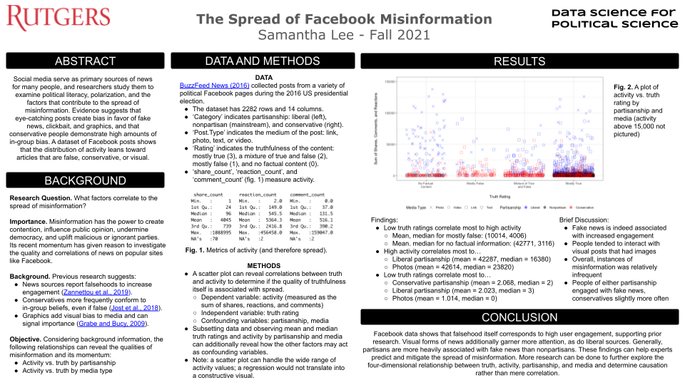
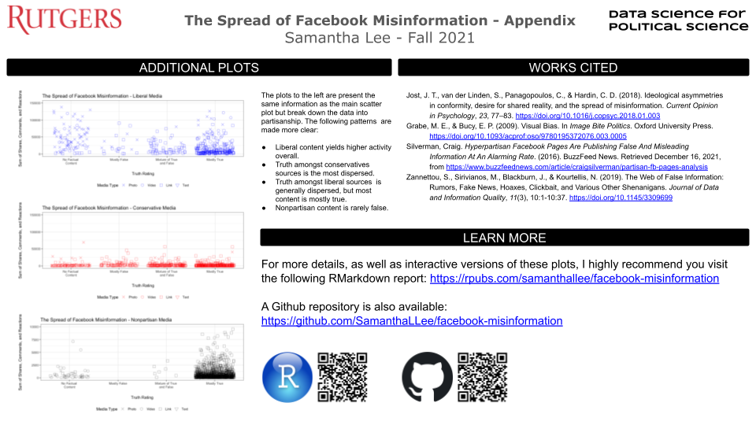

### Abstract

Social media serve as primary sources of news for many people, and researchers study them to examine political literacy, polarization, and the factors that contribute to the spread of misinformation. Evidence suggests that eye-catching posts create bias in favor of fake news, clickbait, and graphics, and that conservative people demonstrate high amounts of in-group bias. A dataset of Facebook posts shows that the distribution of activity leans toward articles that are false, conservative, or visual.

<a href="/docs/Facebook-Misinformation.pdf">

</a>

<a href="/docs/Facebook-Misinformation.pdf">

</a>